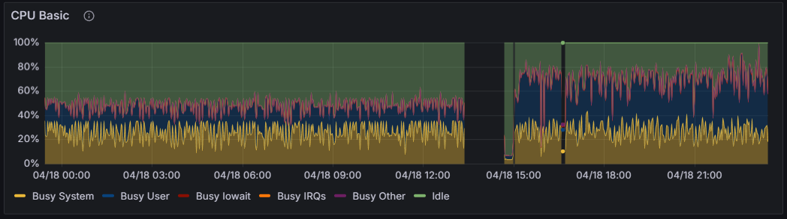

# Migrate From Ingress Nginx to Cilium Ingress
 This will allow me to have more control over the ingress traffic and also to use the Cilium network policies to secure the ingress traffic. This will help to reduce the attack surface of the cluster and make it more secure.
 
 Also will remove one of the components from the cluster and reduce the resource usage. This will help to make the setup more efficient and reduce the cost of running the cluster.

# Migrate ArgoCD to FluxCD
ArgoCD Is using a lot of resources and is not needed for the current setup. We can use FluxCD to manage our GitOps workflow. This will help us to reduce the resource usage and make the setup more efficient.

I'm managed to put all ArgoCD resources in my Raspberry PI and it consumes the whole NODE byt itself and does not perform well. 

On the following images, it shows the CPU consumption and Thermal thermal throttling of the Raspberry PI.
## CPU

## Thermal Throttling

I currently run my raspberry PI with passive cooling and I don't want to add noise through extra cooling for my setup.

## Solution
Migrate ArgoCD to FluxCD. This will help to reduce the resource usage and make the setup more efficient. 