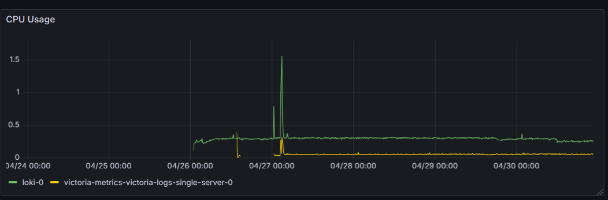
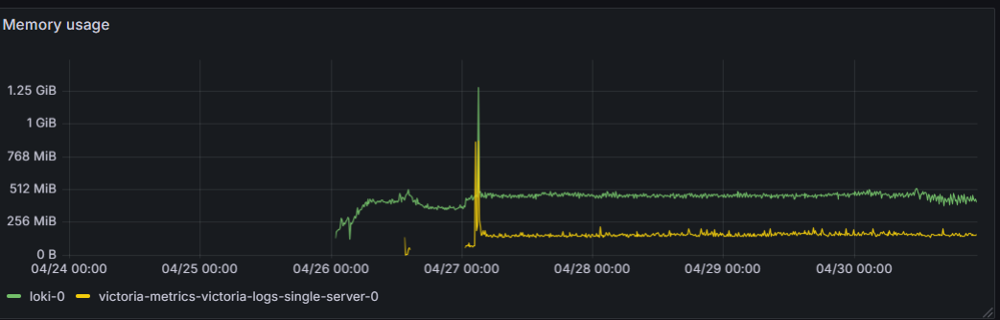
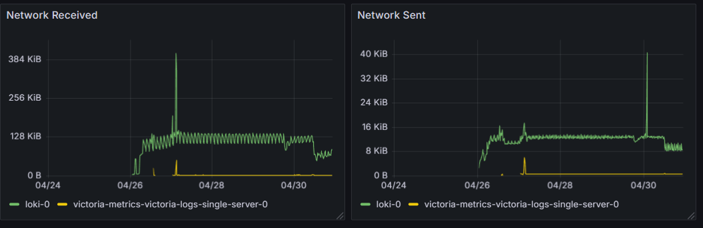
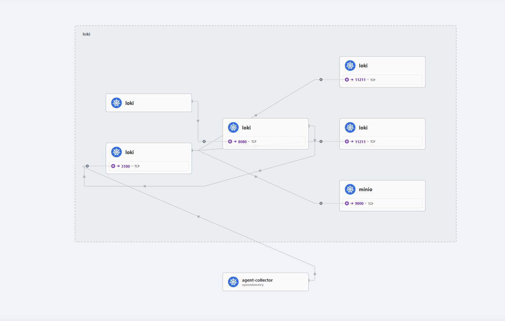
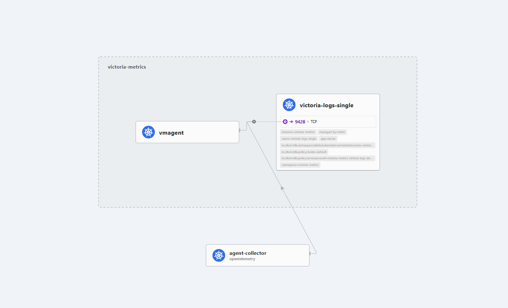
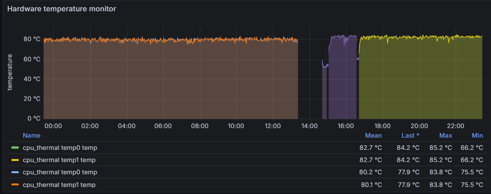

# Header - Priorities
All servers runs in my house. This means that I have to take care of the power consumption and the noise. All following Decisions will have to take this into account.

- Security
- Noise
- Efficiency
- Usability

----------------------------------------
# Stop spreading Helmcharts as default
Helmcharts are great but they also come with a cost. 
For simple configurations like cronjobs or such, instead of using a helmchart, the recommended way now is to create a `kustomization` on FluxCD and leave it as yaml files only. 
This make simpler to configure and there is no creation of layers and layers of configuration.

# Deprecation of RaspPI for K8s
I'm removing my Raspi from K8s to use it in other projects. Soon I'll have another server running that will pose as a replacement.

# Usage of Database Visualization Tools - 2025-05-21

From now on, all Database vissualization tools will NOT be deployed into the cluster and any need to visualize the data will be done using port-forwarding to the database and using the local machine to visualize the data. This will help to reduce the resource usage and make the setup more efficient.

If it gets to a point where I need to visualize the data from outside the cluster, I will use a VPN to connect to the cluster and use the local machine to visualize the data.

In the case there is a need to save visualization queries, this should be done inside this repository and documented into the documentation. This will help to keep track of the queries and make it easier to share with others.

# Use Victoria Logs instead of Loki for Log Aggregator - 2025-05-01
That loki is a great tool, we all know but based on my priorities, Loki uses too much resources and is not efficient for my setup.
One of my priorities is also to reduce the amount of `daemonsets` running in my cluster to reduce overhead and complexity.

## Test Setup
Opentelemetry Collector -> Loki -> Grafana
Opentelemetry Collector -> Victoria Logs

> I only have one instance of Opentelemetry Agent and its exports are going to both Loki and Victoria Logs. This means that the same amount of logs are being sent to both systems.

## CPU usage
As you can see in the following image, Loki pod alone consumes 3x more CPU than Victoria Logs and I'm not even considering the other components required to run Loki.

## Memory usage
Same can be said for the memory usage. 

## Network usage
Network is understandable that Loki have higher usage. This is because it relies on `MinIO` and it requires communication with it. Victoria Logs, on SingleInstance as I'm running, manages it all in the same pod, reducing the network usage.

### Loki Hubble View

### Victoria Logs Hubble View

## Solution
Use Victoria Logs instead of Loki for Log Aggregator. This will help to reduce the resource usage and make the setup more efficient.

## Drawback
By using VictoriaLogs, I'll use its own UI and can't rely on Grafana's default dashboard to visualize the logs. This is a drawback but I think that the benefits of using Victoria Logs outweighs the drawbacks. 
I might be able to have the same visualization as Loki's default on grafana, but I didn't find a way to do it yet.
Its important to mention that Loki has, by default, a better visualization of the logs compared to Victoria Logs, despite prefering VL query language, the default visualization for Loki on Grafana gives a better experience.

# Migrate From Ingress Nginx to Cilium Ingress
 This will allow me to have more control over the ingress traffic and also to use the Cilium network policies to secure the ingress traffic. This will help to reduce the attack surface of the cluster and make it more secure.
 
 Also will remove one of the components from the cluster and reduce the resource usage. This will help to make the setup more efficient and reduce the cost of running the cluster.

# Migrate ArgoCD to FluxCD
ArgoCD Is using a lot of resources and is not needed for the current setup. We can use FluxCD to manage our GitOps workflow. This will help us to reduce the resource usage and make the setup more efficient.

I'm managed to put all ArgoCD resources in my Raspberry PI and it consumes the whole NODE byt itself and does not perform well. 

On the following images, it shows the CPU consumption and Thermal thermal throttling of the Raspberry PI.
## CPU

## Thermal Throttling

I currently run my raspberry PI with passive cooling and I don't want to add noise through extra cooling for my setup.

## Solution
Migrate ArgoCD to FluxCD. This will help to reduce the resource usage and make the setup more efficient. 